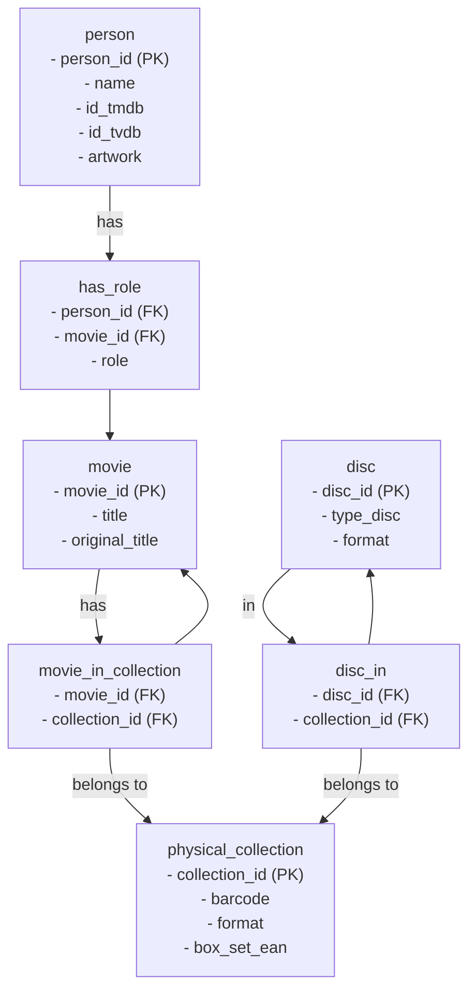

```mermaid
flowchart TD
    movie["movie\n- movie_id (PK)\n- title\n- original_title"]
    disc["disc\n- disc_id (PK)\n- type_disc\n- format"]
    physical_collection["physical_collection\n- collection_id (PK)\n- barcode\n- format\n- box_set_ean"]
    person["person\n- person_id (PK)\n- name\n- id_tmdb\n- id_tvdb\n- artwork"]
    has_role["has_role\n- person_id (FK)\n- movie_id (FK)\n- role"]
    movie_in_collection["movie_in_collection\n- movie_id (FK)\n- collection_id (FK)"]
    disc_in["disc_in\n- disc_id (FK)\n- collection_id (FK)"]

    movie -->|has| movie_in_collection
    movie_in_collection -->|belongs to| physical_collection

    disc -->|in| disc_in
    disc_in -->|belongs to| physical_collection

    person -->|has| has_role
    has_role --> movie

    disc_in --> disc
    movie_in_collection --> movie
```
